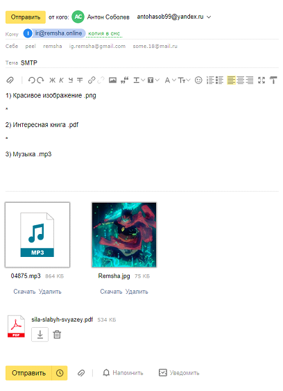
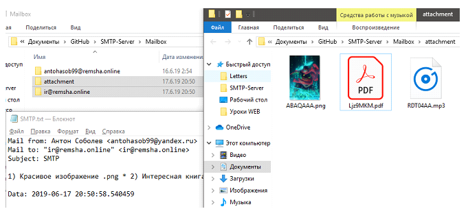

# SMTP Server
Реализация протокола в соответствии стандарту RFC 5321

### Информация
Описание данной работы изложено по [ссылке](https://drive.google.com/open?id=1wqg_qWe2PHAdq0MPPVMRYyJUvzZvYHtp)

### Запуск
```
 C:\SMTP-Server>python main.py [port] (default port=25) 
```

### Сессия
Для взаимодействия с Сервером вам понадобится SMTP Client, его необходимо подключить на (localhost, port). Формат сессии приведён ниже

### Изображение-1 [Получаем письмо из вне в наше доменное имя]



>Сервер успешно получает/отправляет письма в почтовые ящики yandex.ru и mail.ru, для gmail.com работает только получение.

### Изображение-2 [Отправляем письмо в почтовый ящик mail.ru представивщийсь именем username@urfu.ru]


### Пример простейшей сессии


### Зависимости
- Необходим интерпретатор Python версии не ниже, чем 3.6
