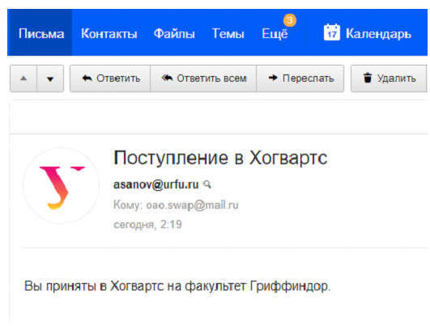

# SMTP Server
Реализация протокола в соответствии стандарту RFC 5321

# Информация
Описание данной работы изложенно по [ссылке](https://drive.google.com/open?id=1wqg_qWe2PHAdq0MPPVMRYyJUvzZvYHtp)

# Запуск
> C:\SMTP-Server>python main.py [port || defult port=25] 

# Сессия
Для взаимодействия с Сервером вам понадобится SMTP Client, его необходимо подключить на (localhost, port). Формат сессии приведён ниже

# Изображение-1 [Получаем письмо из вне в наше доменное имя]

# Изображение-2 [Отправляем письмо в почтовый ящик mail.ru представивщийсь именем username@urfu.ru]

# Пример простейшей сессии
<<<<<<< Updated upstream
C: — клиент, S: — сервер
S: (ожидает соединения)
C: (Подключается к порту 25 сервера)
S:220 mail.remsha.online SMTP is glad to see you!
C:HELO
S:250 OK
C:MAIL FROM: <cat@remsha.online>
S:250 OK
C:RCPT TO: <dog@remsha.online>
S:250 OK
C:DATA
S:354 OK, Enter data, terminated with a \\r\\n.
C:From: Some User <cat@remsha.online>
C:To: Other User <dog@remsha.online>
C:Subject: tema
C:Content-Type: text/plain
C:
C:Hi!
C:.
S:250 769947 message accepted for delivery
C:QUIT
S:221 remsha.online Service closing
S: (закрывает соединение)

>Необходим интерпретатор Python версии не ниже, чем 3.6
=======

>>>>>>> Stashed changes
